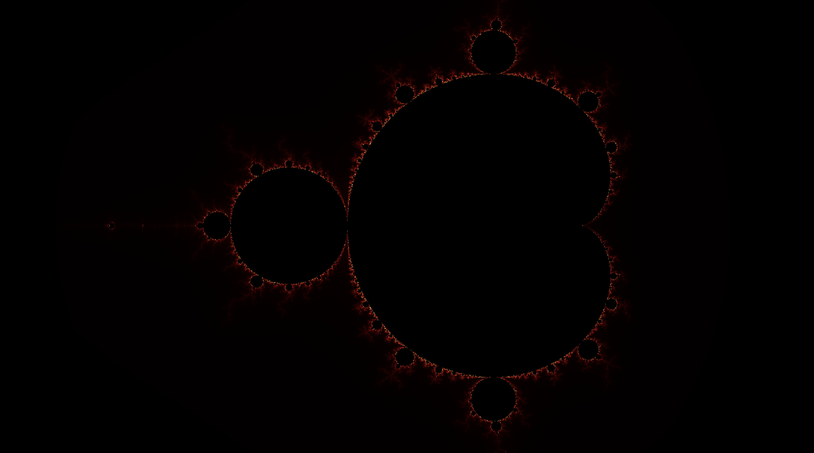

# CUDA Mandelbrot Renderer

A high-performance **Mandelbrot set renderer** written in **C++ and CUDA**, with an optional **CPU fallback** for systems without an NVIDIA GPU.

This project demonstrates GPU parallelism, efficient memory management, and numerical visualization without any external graphics libraries.

---

## Features

- **CUDA-accelerated Mandelbrot computation**
- **CPU fallback mode** (OpenMP)
- Generates a `.ppm` image of the Mandelbrot fractal
- Demonstrates thread/block indexing, device memory, and smooth coloring
- Clean modular CMake project structure

---

## Requirements

### For CUDA build
| Component | Minimum Version | Purpose |
|------------|----------------|----------|
| **CMake** | ≥ 3.20 | Project build system |
| **NVIDIA CUDA Toolkit** | ≥ 12.0 | NVCC compiler & runtime |
| **GPU Compute Capability** | ≥ 5.0 | (Maxwell or newer) |

### For CPU-only build
| Component | Purpose |
|------------|----------|
| **C++17 compiler** | (GCC ≥ 9 / Clang ≥ 11 / MSVC ≥ 2019) |
| **OpenMP** | Enables parallel CPU execution |

---

## Building

### GPU (CUDA) Build
```
cmake -S . -B build -DGPU_ARCH=sm_86      # adjust for your GPU (e.g. sm_75, sm_90)
cmake --build build -j
./build/mandelbrot
```
### CPU Build
```
cmake -S . -B build -DBUILD_CPU_ONLY=ON
cmake --build build -j
./build/mandelbrot
```

## Example Output
<p align="center">  </p>

